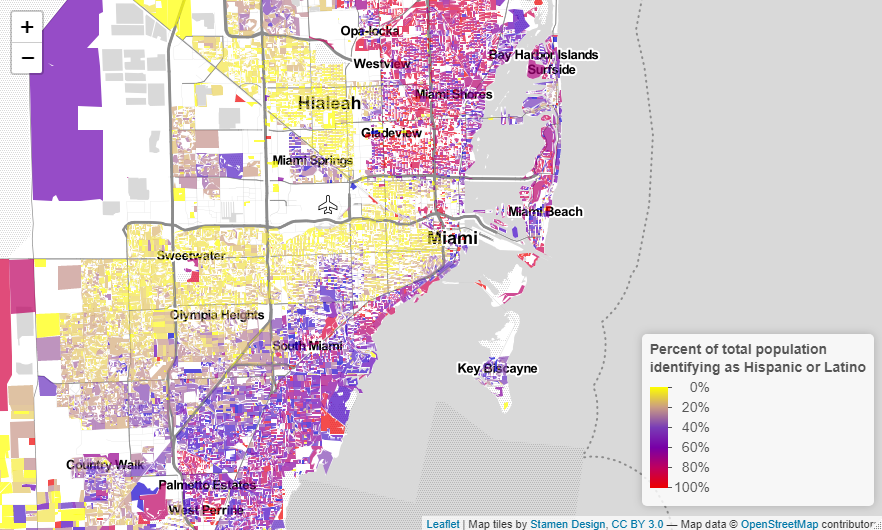
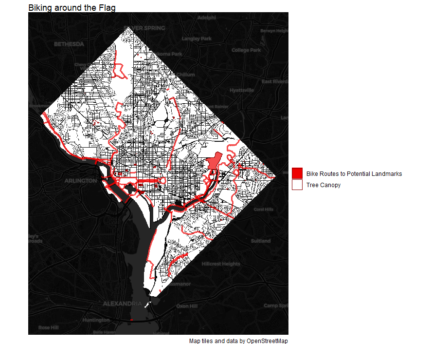
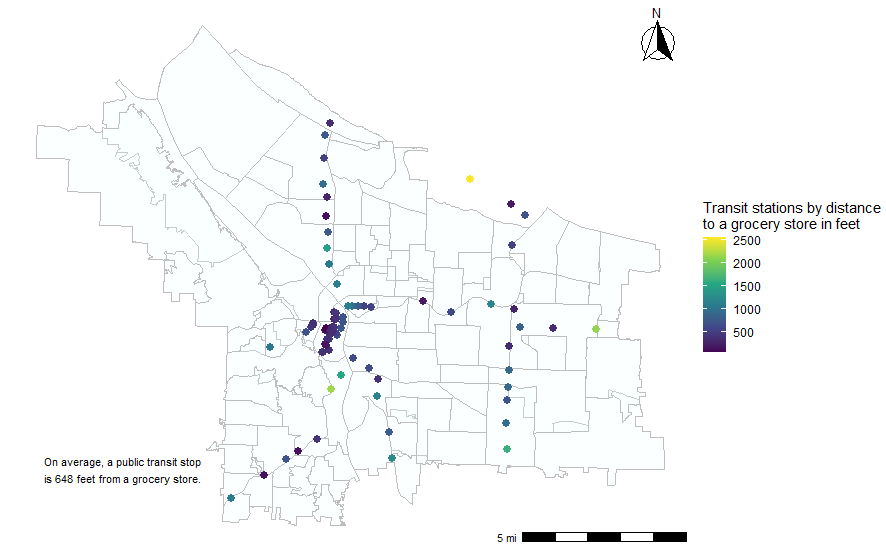
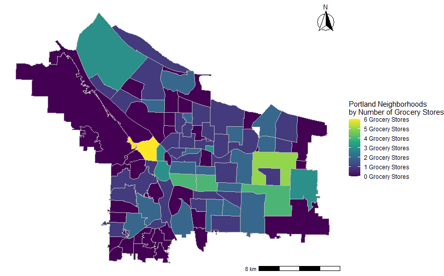
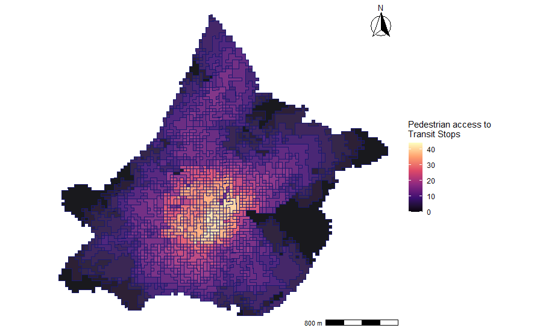
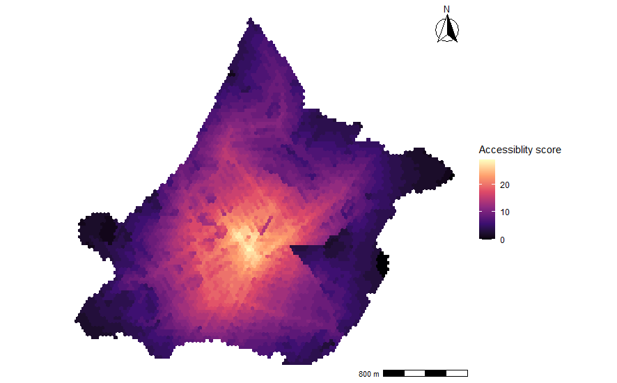
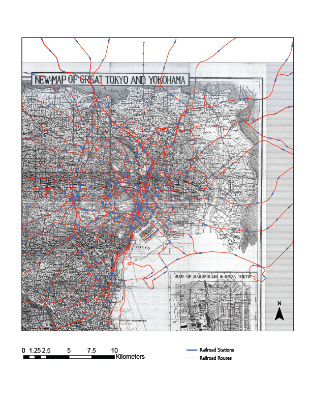

<style>
body {
text-align: justify}
</style>

```{r setup, include=FALSE}
knitr::opts_chunk$set(echo = TRUE)
```


# Introduction

Your portfolio should demonstrate each of the following skills (not all of which are demonstrated in this example):

* Displaying multiple vector layers on the same map 
* Calculating and displaying relationships among point and polygon layers based on distance (Done)
* Aggregating point data to a layer of polygons (Done)
* Calculating and displaying accessibility, based on travel time (Done)
* Converting between raster layers and vector layers (DONE)
* Displaying raster data on a map (Done)
* Georeferencing a raster image (Done)
* Displaying data on an interactive map (Done)

# Miami, Florida


## Interactive Map
Miami is colloquially known as the Capital of Latin America because of the large number of residents who are from or are descendants of residents of South America, Central America, and/or the Caribbean. Miami often conjures images of Calle 8, cafecitos, and Spanglish and depends heavily on these regions for the city’s tourism and finance sectors. Using the decennial Census data from 2010, this interactive map demonstrates the percent of total population of a given census block that identify as Hispanic or Latino. The map is interactive and allows the viewer to explore the expansive and sprawling Miami-Dade County to observe demographic changes and dynamics across the geography. The map is color-coded so as to symbolize the Colombian (or Venezuelan or Ecuadorian) flag and the pop-ups are colored in a Midnight Blue in homage to the UNASUR (Union of South American Nations) and CELAC (Community of Latin American and Caribbean States) flags.

* Skill Demonstrated: Displaying data on an interactive map

<center>
[](https://danielm1996.github.io/dmontoyaportfolio/fullsize/interactive_miami_hl.html){target="_blank"}
</center>

# Washington D.C.

Celebrating the District's Vexillology

This map utilizes the polygons in questions and transforms them into a symbolic representation of the flag of Washington D.C. The origin and design of the capital's flag can be viewed using this link: https://usflags.design/washington-dc/.

The main focus of this map is to highlight the bike routes to the potential monuments against the white canopy. The map would not perform the goal of clarifying the bike routes for a tourist brochure, but rather focuses on experimentation and uses the data as elements of the city's flag. Loosely, the white canopy (against the black base map) represents the background, the red white trails represent the red stripes, and the red potential landmarks represent the flag's stars.

The inspiration came from Washington D.C.'s square shape that emulates the shape of a flag.

<center>
[](https://danielm1996.github.io/dmontoyaportfolio/fullsize/dc_flag.pdf){target="_blank"}
</center>

# Portland, Oregon


This map shows the average distance between grocery stores and public transit stations in Portland (the average (Euclidean) distance between A points and their nearest respective B points). The average distance is about 648 feet. 

## Clockboard Map
This map demonstrates the following skills:

* Aggregating point data to a layer of polygons

<center>
[](https://danielm1996.github.io/dmontoyaportfolio/fullsize/calc_disp_portland.pdf){target="_blank"}
</center>

<center>
[](https://danielm1996.github.io/dmontoyaportfolio/fullsize/points_polygons_portland.pdf){target="_blank"}
</center>

# Chelsea, Massachusetts
Here are two maps of San Luis Obispo, California. I might include some text here as well.

## Isochrones
This map shows isochrones based on transit travel times to the nearest school. It demonstrates the following skills:

* Displaying multiple vector layers on the same map
* Calculating and displaying accessibility, based on travel time

[](https://danielm1996.github.io/dmontoyaportfolio/fullsize/Isochrone_Map_Chelsea.pdf){target="_blank"}

Converitng between Polygons and Vectors.

[](https://danielm1996.github.io/dmontoyaportfolio/fullsize/Raster_Chelsea.pdf){target="_blank"}

## Accessibility
This map shows accessibility based on a distance-decay function of the walking time to the nearest transit stop. It demonstrates the following skills:

* Displaying multiple vector layers on the same map
* Calculating and displaying accessibility, based on travel time
* Displaying raster data on a map

[](https://danielm1996.github.io/dmontoyaportfolio/fullsize/Access_Chelsea.pdf){target="_blank"}

# Tokyo, Japan

Our selected map of Tokyo City in 1934, highlights the
strategic production, energy and defense infrastructure
located in the city in a pre-World War II era. We chose this
map because we thought it would be interesting to see if the
1934 infrastructure locations would correlate to modern day
transportation flows and routes.
Our maps evaluate transportation infrastructure by using
three distinct, yet related, maps: • Railroads, which measure intra-city transportation
mobility.

Through the mapping, we learned that many of the strategic infrastructures in 1934 were transformed into different
programs and uses in today’s Tokyo. Nonetheless, many of them are still important public spaces and can be seen
through the transportation lines and hubs. Also, we also observed that many of today’s roads/rails can be related
with previous paths in 1934. Through the mapping of the Railway system, Highway system and Inner city public
transportation like bus and bike, we got a better understanding of Tokyo’s traffic at various scales.

[](https://danielm1996.github.io/dmontoyaportfolio/fullsize/georeferencing_tokyo.pdf){target="_blank"}

Comments:

A1 Use Alpha
A2 Consistency
A3  You can create a table of contents automatically by replacing output: html_document at the top of your file with output: html_document: toc: true toc_depth: 3 toc_float: true
A45
A6


```{r cars}
summary(cars)
```

## Including Plots

You can also embed plots, for example:

```{r pressure, echo=FALSE}
plot(pressure)
```

Note that the `echo = FALSE` parameter was added to the code chunk to prevent printing of the R code that generated the plot.
